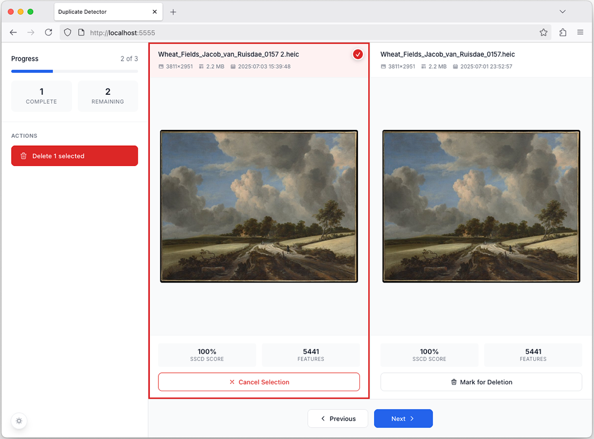
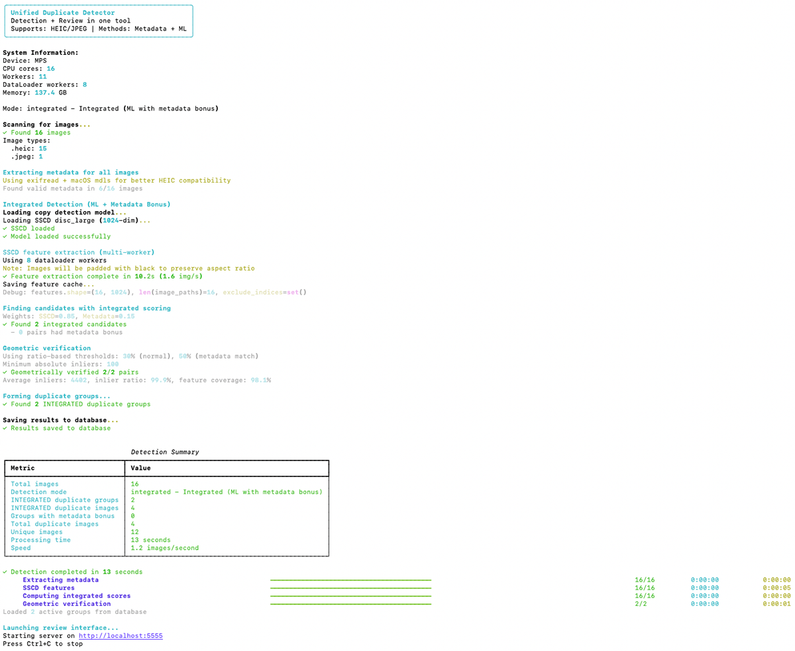

# Duplicate Image Detector

<p align="left">
  
</p>

A tool for finding duplicate and near-duplicate images. Then removing those files using a simple UI.

## Get started

```bash
# Install uv package manager
curl -LsSf https://astral.sh/uv/install.sh | sh

# Clone repository
git clone https://github.com/logbarron/duplicate-detector
cd duplicate-image-detect

# Make script executable
chmod +x duplicate-detector.py

# Run to start
./duplicate-detector.py /path/to/your/images

# Web interface opens at 
http://localhost:5555
```

## Image Pipeline

```bash
1. Scan & Find Images
2. Extract Metadata
3. Generate Neural ML Features
4. Find Similar Pairs
5. Geometric Verification
6. Group Duplicates
7. Web UI Review
```
<p align="left">
  
</p>

## Documentation

For detailed technical information, advanced configuration options, and troubleshooting, see [TECHNICAL.md](TECHNICAL.md).

## Important Note

**This tool permanently modifies your photo files**. Selected files for deletion will be deleted. Always maintain backups.

**AI-Assisted Development**: This project was developed with AI language models. While extensively tested, please review the implementation for your specific use case.

## License

[GPL v3](LICENSE) - Copyright © 2025 Logan Barron